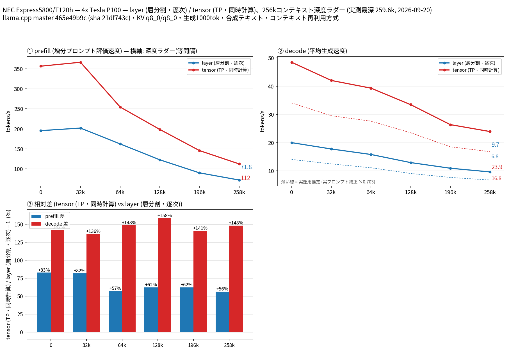

# Tesla P100 4 枚で Qwen3.8 27B の split-mode を比較

- **作成者**: miminashi
- **作成日**: 2026-09-20

## 概要

NEC Express5800/T120h（Tesla P100-PCIE-16GB × 4）で Qwen3.8 27B UD-Q4_K_XL（MTP 投機的デコード付き）を 262k コンテキストまで測定し、`--split-mode layer` と `tensor` を比較しました。
全深度で tensor が速く、prefill は layer 比 +56〜83%、decode は +136〜158%（depth 0 で 20.0 → 48.5 t/s、258k で 9.7 → 23.9 t/s）でした。
モデル（17.6 GB）が P100 1 枚（16 GB）に載らないため、単一 GPU のベースラインは測定していません。

## ハードウェア

| 項目 | 内容 |
|------|------|
| コンピュータ / マザーボード | NEC Express5800/T120h |
| GPU | Tesla P100-PCIE-16GB × 4（VRAM 16 GB / 枚、compute capability 6.0） |
| GPU 接続 | 全枚 PCIe 3.0 x16、NVLink なし。GPU0・1 が NUMA node0、GPU2・3 が node1 に接続（node をまたぐ GPU 間通信は CPU 間インターコネクト経由） |
| CPU | Intel Xeon Gold 6138 × 2（20 コア / 40 スレッド × 2） |
| メモリ | 251 GiB（種類・速度は不明） |
| 電源 | 不明 |

## ソフトウェア環境

| 項目 | 内容 |
|------|------|
| OS | Ubuntu 22.04.5 LTS / Linux 5.15.0-191-generic |
| GPU ドライバ | NVIDIA 575.51.03 |
| llama.cpp | build 10830（commit 465e49b9c、2026-09-07）、CUDA バックエンド |

## ベンチマーク

### 条件

| 項目 | 内容 |
|------|------|
| ツール | llama-split-bench 7af72d4 |
| モデル | Qwen3.8-27B-UD-Q4_K_XL（17.6 GB）＋ MTP ヘッド mtp-Qwen3.8-27B-Q4_0（1.4 GB） |
| 測定モード | layer / tensor（いずれも CUDA0〜3 の 4 枚）。single は VRAM 不足のため未実施 |
| ctx / stages | 262144 / 0,32000,64000,128000,196000,258000 |
| KV キャッシュ | q8_0 / q8_0 |
| 投機的デコード | `--spec-type draft-mtp -md <MTP ヘッド> --spec-draft-n-max 2` |
| その他 | `-fa on`、`-t 20`、`LAUNCH_PREFIX` なし、生成 1000 トークン / 段 |

### 結果

depth ごとの prefill / decode（t/s）。depth 0 の prefill は新規プロンプト（pp2048）の値です。decode はラダーの合成テキストでの実測値です。

| depth | prefill layer | prefill tensor | decode layer | decode tensor |
|------:|------:|------:|------:|------:|
| 0 | 195.5 | 356.9 | 20.0 | 48.5 |
| 32k | 201.9 | 366.7 | 17.8 | 42.0 |
| 64k | 162.2 | 254.6 | 15.8 | 39.3 |
| 128k | 122.4 | 198.5 | 13.0 | 33.5 |
| 196k | 89.8 | 145.5 | 11.0 | 26.4 |
| 258k | 71.8 | 112.1 | 9.7 | 23.9 |

depth 0 の新規プロンプト prefill（t/s）:

| プロンプト長 | layer | tensor |
|------:|------:|------:|
| 512 | 129.4 | 389.7 |
| 2048 | 195.5 | 356.9 |
| 8192 | 223.0 | 405.6 |

MTP の採択率は、ラダーの合成テキストでは 0.97〜1.0 でした。実プロンプト 3 本（temperature 0.7、tensor モード）では 0.54〜0.66、decode は 31.9〜35.6 t/s でした。ここから求めた補正係数 0.703 を掛けた値を、図に破線の「実運用推定」として示しています（258k で layer 6.8 t/s、tensor 16.8 t/s）。

### 所感

- 全深度で tensor が prefill・decode ともに速いです。特に decode は layer の約 2.4〜2.6 倍です。P100 4 枚で 27B を動かすなら tensor を選ぶべき、という結果になりました。
- NVLink が無く、GPU が 2 つの NUMA ノードに分かれている構成でも、tensor の AllReduce のオーバーヘッドは並列計算の利得を打ち消すほど大きくありませんでした。
- 262k コンテキストでも VRAM 使用量は layer で最大 12.7 GB / 枚、tensor で 8.9 GB / 枚でした（起動直後）。KV キャッシュが小さいので、コンテキストは縮めずに済みました。
- tensor モードでは、VRAM が 4 枚に均等に割り振られていました。layer モードでは、最後の GPU（GPU3）が他の GPU より約 4 GB 多く使っていました。

## 添付

- [run-info.json](attachment/2026-09-20_033840_comparing_split_modes_of_qwen3.8_27b_on_4x_tesla_p100/run-info.json)
- [split-bench-en.png](attachment/2026-09-20_033840_comparing_split_modes_of_qwen3.8_27b_on_4x_tesla_p100/split-bench-en.png)
- [results-layer.json](attachment/2026-09-20_033840_comparing_split_modes_of_qwen3.8_27b_on_4x_tesla_p100/results-layer.json) / [results-layer-pp0.json](attachment/2026-09-20_033840_comparing_split_modes_of_qwen3.8_27b_on_4x_tesla_p100/results-layer-pp0.json)
- [results-tensor.json](attachment/2026-09-20_033840_comparing_split_modes_of_qwen3.8_27b_on_4x_tesla_p100/results-tensor.json) / [results-tensor-pp0.json](attachment/2026-09-20_033840_comparing_split_modes_of_qwen3.8_27b_on_4x_tesla_p100/results-tensor-pp0.json)
- [results-real.json](attachment/2026-09-20_033840_comparing_split_modes_of_qwen3.8_27b_on_4x_tesla_p100/results-real.json)
- [argv-layer.txt](attachment/2026-09-20_033840_comparing_split_modes_of_qwen3.8_27b_on_4x_tesla_p100/argv-layer.txt) / [argv-tensor.txt](attachment/2026-09-20_033840_comparing_split_modes_of_qwen3.8_27b_on_4x_tesla_p100/argv-tensor.txt)
