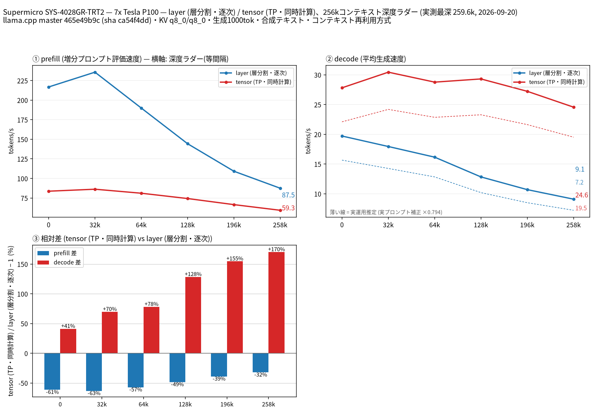

# Tesla P100 7 枚で Qwen3.8 27B の split-mode を比較

- **作成者**: miminashi
- **作成日**: 2026-09-20

## 概要

Supermicro SYS-4028GR-TRT2（Tesla P100-PCIE-16GB × 7）で Qwen3.8 27B UD-Q4_K_XL（MTP 投機的デコード付き）を 262k コンテキストまで測定し、`--split-mode layer` と `tensor` を比較しました。
decode は全深度で tensor が速く（depth 0 で 19.7 → 27.8 t/s、258k で 9.1 → 24.6 t/s、+41〜170%）、prefill は逆に全深度で layer が速い（258k で 87.5 対 59.3 t/s）という結果になりました。
ただし**この機械では 7 枚の tensor 分割は既定の NCCL AllReduce が起動時にハングするため、`GGML_CUDA_ALLREDUCE=none` を付けて測っています**。prefill が振るわないのはこの回避策の影響が大きいとみられます（「所感」参照）。
モデル（17.6 GB）が P100 1 枚（16 GB）に載らないため、単一 GPU のベースラインは測定していません。

## ハードウェア

| 項目 | 内容 |
|------|------|
| コンピュータ / マザーボード | Supermicro SYS-4028GR-TRT2（M/B X10DRG-OT+-CPU） |
| GPU | Tesla P100-PCIE-16GB × 7（VRAM 16 GB / 枚、compute capability 6.0） |
| GPU 接続 | 全枚 PCIe 3.0 x16、NVLink なし。7 枚とも NUMA node0 側にぶら下がる。GPU0〜2 と GPU3〜6 がそれぞれ同じ PCIe スイッチ配下（`nvidia-smi topo -m` で PIX）、2 つのグループ間は PCIe ホストブリッジ経由（PHB） |
| CPU | Intel Xeon E5-2687W v4 × 2（12 コア / 24 スレッド × 2） |
| メモリ | 157 GiB（種類・速度は不明） |
| 電源 | 4 台（型番・容量は不明） |

## ソフトウェア環境

| 項目 | 内容 |
|------|------|
| OS | Ubuntu 24.04.3 LTS / Linux 6.8.0-90-generic |
| GPU ドライバ | NVIDIA 535.288.01 |
| llama.cpp | build 10830（commit 465e49b9c）、CUDA バックエンド |

## ベンチマーク

### 条件

| 項目 | 内容 |
|------|------|
| ツール | llama-split-bench 7af72d4 |
| モデル | Qwen3.8-27B-UD-Q4_K_XL（17.6 GB）＋ MTP ヘッド mtp-Qwen3.8-27B-Q4_0（1.4 GB） |
| 測定モード | layer / tensor（いずれも CUDA0〜6 の 7 枚）。single は VRAM 不足のため未実施 |
| ctx / stages | 262144 / 0,32000,64000,128000,196000,258000 |
| KV キャッシュ | q8_0 / q8_0 |
| 投機的デコード | `--spec-type draft-mtp -md <MTP ヘッド> --spec-draft-n-max 2` |
| その他 | `-fa on`、`-t 24`、`LAUNCH_PREFIX="env GGML_CUDA_ALLREDUCE=none"`、生成 1000 トークン / 段 |

### 結果

depth ごとの prefill / decode（t/s）。depth 0 の prefill は新規プロンプト（pp2048）の値です。decode はラダーの合成テキストでの実測値です。

| depth | prefill layer | prefill tensor | decode layer | decode tensor |
|------:|------:|------:|------:|------:|
| 0 | 216.8 | 83.7 | 19.7 | 27.8 |
| 32k | 235.7 | 86.2 | 17.9 | 30.4 |
| 64k | 189.9 | 81.1 | 16.2 | 28.8 |
| 128k | 144.3 | 74.3 | 12.8 | 29.3 |
| 196k | 109.2 | 66.6 | 10.7 | 27.2 |
| 258k | 87.5 | 59.3 | 9.1 | 24.6 |

depth 0 の新規プロンプト prefill（t/s）:

| プロンプト長 | layer | tensor |
|------:|------:|------:|
| 512 | 126.7 | 81.7 |
| 2048 | 216.8 | 83.7 |
| 8192 | 254.4 | 83.8 |

MTP の採択率は、ラダーの合成テキストでは layer が 0.97〜1.0、tensor が 0.80〜1.0 でした。実プロンプト 3 本（temperature 0.7、tensor モード）では 0.50〜0.57、decode は 21.5〜23.1 t/s でした。ここから求めた補正係数 0.794 を掛けた値を、図に破線の「実運用推定」として示しています（258k で layer 7.2 t/s、tensor 19.5 t/s）。

### 所感

- **decode は全深度で tensor が勝ちます**。深いほど差が開き、258k では layer の 2.7 倍です。tensor の decode は depth 0 の 27.8 t/s から 258k の 24.6 t/s までしか落ちず、layer が 19.7 → 9.1 t/s と半分以下になるのとは対照的でした。長いコンテキストを抱えたまま生成する用途では tensor 一択です。
- **prefill は全深度で layer が勝ちました。ただしこれは回避策込みの値です**。この機械では 7 枚の tensor 分割を既定の NCCL AllReduce で起動するとハングするため（別途 13 回連続で失敗を確認）、`GGML_CUDA_ALLREDUCE=none` を付けて測っています。同じ機械で条件をそろえた別の計測では、この回避策だけで prefill が 8 割方失われていました。したがって「P100 7 枚では tensor の prefill が遅い」のではなく、「NCCL が使えない状態の tensor は prefill が遅い」と読むべきです。
- tensor の prefill がプロンプト長にほとんど反応しない（pp512 で 81.7、pp8192 で 83.8 t/s）のも、計算ではなく通信で律速していることの傍証だと思います。layer は 126.7 → 254.4 t/s と素直に伸びました。
- 同じモデル・同じ llama.cpp で測った [Tesla P100 4 枚（NEC Express5800/T120h）](2026-09-20_033840_comparing_split_modes_of_qwen3.8_27b_on_4x_tesla_p100.md)と比べると、layer の prefill は 7 枚のほうが 2 割ほど速い一方（258k で 71.8 → 87.5 t/s）、decode はほぼ同じでした（9.7 → 9.1 t/s）。tensor は 4 枚の機械が NCCL をそのまま使えるぶん prefill が大きく勝ちます（258k で 112.1 対 59.3 t/s）。decode は枚数が増えてもほぼ変わりませんでした（258k で 23.9 対 24.6 t/s）。**枚数を増やすより、AllReduce が正常に動くことのほうが効く**という結果です。
- VRAM は 262k コンテキストでも余裕がありました（起動直後、最深段で layer が最大 10.2 GB / 枚、tensor が 6.2 GB / 枚）。tensor では 7 枚に均等に配分され、layer では最後の GPU（GPU6）が他より約 4 GB 多く使っていました。4 枚の機械と同じ傾向です。
- 実プロンプトでの MTP 採択率（0.50〜0.57）は、4 枚の機械の tensor（0.54〜0.66）と同程度でした。

## 添付

- [run-info.json](attachment/2026-09-20_072013_comparing_split_modes_of_qwen3.8_27b_on_7x_tesla_p100/run-info.json)
- [split-bench-en.png](attachment/2026-09-20_072013_comparing_split_modes_of_qwen3.8_27b_on_7x_tesla_p100/split-bench-en.png)
- [results-layer.json](attachment/2026-09-20_072013_comparing_split_modes_of_qwen3.8_27b_on_7x_tesla_p100/results-layer.json) / [results-layer-pp0.json](attachment/2026-09-20_072013_comparing_split_modes_of_qwen3.8_27b_on_7x_tesla_p100/results-layer-pp0.json)
- [results-tensor.json](attachment/2026-09-20_072013_comparing_split_modes_of_qwen3.8_27b_on_7x_tesla_p100/results-tensor.json) / [results-tensor-pp0.json](attachment/2026-09-20_072013_comparing_split_modes_of_qwen3.8_27b_on_7x_tesla_p100/results-tensor-pp0.json)
- [results-real.json](attachment/2026-09-20_072013_comparing_split_modes_of_qwen3.8_27b_on_7x_tesla_p100/results-real.json)
- [argv-layer.txt](attachment/2026-09-20_072013_comparing_split_modes_of_qwen3.8_27b_on_7x_tesla_p100/argv-layer.txt) / [argv-tensor.txt](attachment/2026-09-20_072013_comparing_split_modes_of_qwen3.8_27b_on_7x_tesla_p100/argv-tensor.txt)
