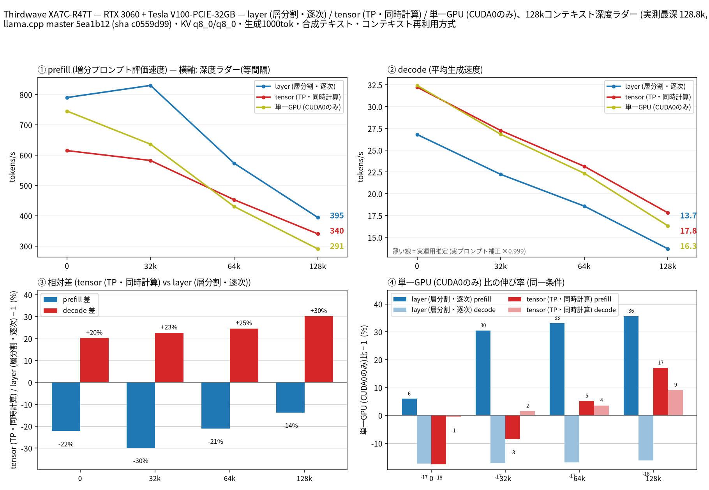

# RTX 3060 + Tesla V100 で Qwen3.8 27B の split-mode を比較

- **作成者**: eightman999
- **作成日**: 2026-09-21

## 概要

Thirdwave XA7C-R47T（RTX 3060 12GB + Tesla V100-PCIE-32GB、NVLink なし・V100 は PCIe 3.0 x4）で Qwen3.8 27B Q4_K_M（約 16 GB）を 131k コンテキストまで測定し、`--split-mode layer` / `tensor`、および V100 単体を比較しました。
decode は全深度で tensor ≒ V100 単体が layer を上回り（depth 0 で 26.8 → 32.2 t/s、128k で 13.7 → 17.8 t/s）、prefill は全深度で layer が最速でした。
3060 単体はモデル自体が 12 GB を超えるため起動できず未測定です。MTP ドラフトヘッドは手元に無かったため投機的デコードは無効です。

## ハードウェア

| 項目 | 内容 |
|------|------|
| コンピュータ / マザーボード | Thirdwave XA7C-R47T / ASRock B760 TW/D4 |
| GPU | NVIDIA GeForce RTX 3060 12GB（SM86）+ Tesla V100-PCIE-32GB（SM70）。VRAM 12 GB + 32 GB |
| GPU 接続 | PCIe、NVLink なし。両 GPU は PHB（PCIe ホストブリッジ）経由で接続。V100 は **PCIe 3.0 x4**（最大 x16 だが実効 x4）、3060 は最大 PCIe 4.0 x16 |
| CPU | 13th Gen Intel Core i7-13700F（16 コア / 24 スレッド） |
| メモリ | 45 GiB |
| 電源 | 不明 |

## ソフトウェア環境

| 項目 | 内容 |
|------|------|
| OS | Ubuntu 26.04.1 LTS / Linux 7.0.0-31-generic |
| GPU ドライバ | NVIDIA 580.178.04 |
| llama.cpp | commit 5ea1b12、CUDA バックエンド（`-DCMAKE_CUDA_ARCHITECTURES="70;86"` で再ビルド。NCCL ライブラリは未検出のため未リンク） |

### デバイス番号の注意

`nvidia-smi` の番号と llama.cpp の `CUDAn` は一致しません（CUDA の列挙順が逆転）:

| llama.cpp | 実 GPU（nvidia-smi） |
|-----------|----------------------|
| CUDA0 | Tesla V100-PCIE-32GB（nvidia-smi index 1） |
| CUDA1 | RTX 3060 12GB（nvidia-smi index 0） |

本計測の `single_v100` は `--device CUDA0`、layer/tensor は `--device CUDA0,CUDA1` です。

## ベンチマーク

### 条件

| 項目 | 内容 |
|------|------|
| ツール | llama-split-bench 7af72d4 |
| モデル | Qwen3.8-27B Q4_K_M（約 16 GB、`qwen3.8-27b-q4_K_M.gguf`） |
| 測定モード | layer / tensor（CUDA0+CUDA1）、single_v100（CUDA0）。single_3060 は VRAM 不足で起動失敗のため除外 |
| ctx / stages | 131072 / 0,32000,64000,128000（262144 は試さず。両 GPU 合計 VRAM と q8_0 KV を見て 131k を採用） |
| KV キャッシュ | q8_0 / q8_0 |
| 投機的デコード | なし（`SPEC_ARGS=`。MTP ドラフトヘッド無し） |
| その他 | `-fa on`、`-t 8`、`-ngl all`、生成 1000 トークン / 段、PORT 18081（Open-WebUI :3000 は未停止） |

### 結果

depth ごとの prefill / decode（t/s）。depth 0 の prefill は新規プロンプト（pp2048）の値です。ラダー初段（11 トークン）の prefill は表に載せていません。decode はラダーの合成テキストでの実測値です。

| depth | prefill layer | prefill tensor | prefill single_v100 | decode layer | decode tensor | decode single_v100 |
|------:|------:|------:|------:|------:|------:|------:|
| 0 | 790.2 | 615.1 | 745.6 | 26.8 | 32.2 | 32.4 |
| 32k | 830.1 | 582.5 | 636.2 | 22.2 | 27.3 | 26.8 |
| 64k | 573.5 | 452.9 | 430.6 | 18.6 | 23.2 | 22.4 |
| 128k | 394.6 | 340.4 | 290.7 | 13.7 | 17.8 | 16.3 |

depth 0 の新規プロンプト prefill（t/s）:

| プロンプト長 | layer | tensor | single_v100 |
|------:|------:|------:|------:|
| 512 | 627.4 | 562.6 | 709.5 |
| 2048 | 790.2 | 615.1 | 745.6 |
| 8192 | 933.6 | 638.8 | 753.0 |

投機的デコード無しのため、実プロンプト補正係数はほぼ 1.0（0.999）でした。図の破線「実運用推定」は実測とほぼ重なります。

### 所感

- **decode は tensor と V100 単体がほぼ同等で、layer より速い**。depth 0 で layer 26.8 t/s に対し tensor 32.2 / single 32.4 t/s。128k でも layer 13.7 に対し tensor 17.8 / single 16.3 t/s。layer はパイプライン气泡の影響で単体より遅く、深いほど差が開きます。
- **tensor の decode が V100 単体をわずかに上回る**（特に 64k〜128k）一方、**prefill は layer が全深度で最速**、tensor は single より浅い深度で負け、深い深度では single よりマシ、という位置です。V100 が **PCIe 3.0 x4** でホスト／もう一方の GPU と繋がっているため、tensor の同期コストが prefill を押し下げている可能性が高いです（NCCL 未リンクの警告もあり、AllReduce は非 NCCL 経路）。
- **3060 単体は不可**。モデル約 16 GB に対し VRAM 12 GB のためロード失敗。ヘテロ構成では「大きい方の GPU に載るか」が single ベースラインの前提になります。
- **layer の VRAM 配分**は起動時おおよそ 3060 側 ~6.8 GB / V100 側 ~15.6 GB、tensor は両カードにほぼ均等（各 ~8〜11 GB）。131k + q8_0 KV でも OOM せず完走しました。
- 投機なしの生 decode としては、このヘテロ 2 枚構成で「長文生成なら tensor（または V100 単体）、プリフィル重視なら layer」が実測上の答えです。NVLink や x16 接続の同型カード同士と比べると、tensor の伸びは控えめです。

## 添付

- [run-info.json](attachment/2026-09-21_170911_comparing_split_modes_of_qwen3.8_27b_on_rtx3060_and_tesla_v100/run-info.json)
- [split-bench-en.png](attachment/2026-09-21_170911_comparing_split_modes_of_qwen3.8_27b_on_rtx3060_and_tesla_v100/split-bench-en.png)
- [results-layer.json](attachment/2026-09-21_170911_comparing_split_modes_of_qwen3.8_27b_on_rtx3060_and_tesla_v100/results-layer.json) / [results-layer-pp0.json](attachment/2026-09-21_170911_comparing_split_modes_of_qwen3.8_27b_on_rtx3060_and_tesla_v100/results-layer-pp0.json)
- [results-tensor.json](attachment/2026-09-21_170911_comparing_split_modes_of_qwen3.8_27b_on_rtx3060_and_tesla_v100/results-tensor.json) / [results-tensor-pp0.json](attachment/2026-09-21_170911_comparing_split_modes_of_qwen3.8_27b_on_rtx3060_and_tesla_v100/results-tensor-pp0.json)
- [results-single_v100.json](attachment/2026-09-21_170911_comparing_split_modes_of_qwen3.8_27b_on_rtx3060_and_tesla_v100/results-single_v100.json) / [results-single_v100-pp0.json](attachment/2026-09-21_170911_comparing_split_modes_of_qwen3.8_27b_on_rtx3060_and_tesla_v100/results-single_v100-pp0.json)
- [results-real.json](attachment/2026-09-21_170911_comparing_split_modes_of_qwen3.8_27b_on_rtx3060_and_tesla_v100/results-real.json)
- [argv-layer.txt](attachment/2026-09-21_170911_comparing_split_modes_of_qwen3.8_27b_on_rtx3060_and_tesla_v100/argv-layer.txt) / [argv-tensor.txt](attachment/2026-09-21_170911_comparing_split_modes_of_qwen3.8_27b_on_rtx3060_and_tesla_v100/argv-tensor.txt) / [argv-single_v100.txt](attachment/2026-09-21_170911_comparing_split_modes_of_qwen3.8_27b_on_rtx3060_and_tesla_v100/argv-single_v100.txt)
