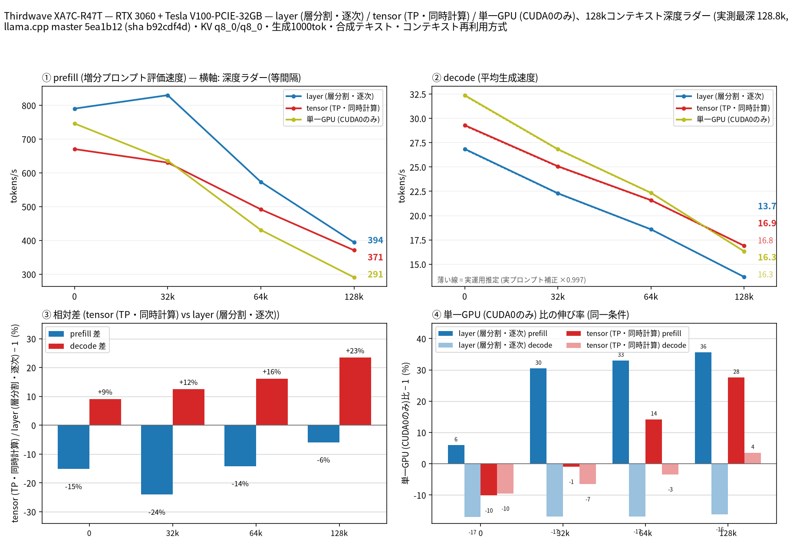

# RTX 3060 + Tesla V100 で Qwen3.8 27B の tensor split を NCCL あり／なしで比較

- **作成者**: eightman999
- **作成日**: 2026-09-21

## 概要

前回の [no-NCCL レポート](2026-09-21_170911_comparing_split_modes_of_qwen3.8_27b_on_rtx3060_and_tesla_v100.md) と同じ機体・同じモデルで、llama.cpp を `GGML_CUDA_NCCL=ON`（CUDA arch 70;86）で別ビルドし直し、NCCL 有効時の layer / tensor / V100 単体を再測定した。
tensor split では深いコンテキストの prefill が約 **+8〜9%** 改善した一方、decode は約 **−5〜9%** 悪化した。layer と V100 単体は実質差なし。NVLink なし・PCIe PHB の混在 GPU では、対話向け decode 主体なら no-NCCL（内部 AllReduce）の方が速く、長文 prefill 重視なら NCCL が効く、という結果になった。

## ハードウェア

| 項目 | 内容 |
|------|------|
| コンピュータ / マザーボード | Thirdwave XA7C-R47T / ASRock B760 TW/D4 |
| GPU | NVIDIA GeForce RTX 3060 12GB（SM86）+ Tesla V100-PCIE-32GB（SM70）。VRAM 12 GB + 32 GB |
| GPU 接続 | PCIe、NVLink なし。両 GPU は PHB（PCIe ホストブリッジ）経由。V100 は **PCIe 3.0 x4**、3060 は最大 PCIe 4.0 x16 |
| CPU | 13th Gen Intel Core i7-13700F（16 コア / 24 スレッド） |
| メモリ | 45 GiB |
| 電源 | 不明 |

## ソフトウェア環境

| 項目 | 内容 |
|------|------|
| OS | Ubuntu 26.04.1 LTS / Linux 7.0.0-31-generic |
| GPU ドライバ | NVIDIA 580.178.04 |
| llama.cpp | commit 5ea1b12、CUDA + **NCCL 2.31.2**（`GGML_CUDA_NCCL=ON`、`-DCMAKE_CUDA_ARCHITECTURES="70;86"` の別ビルド）。リンク確認: `libnccl.so.2`。実行時ログに `NCCL version 2.31.2` / `ncclCommInitAll nranks=2`。前回 no-NCCL ビルドの「NCCL not compiled in」警告は本ランでは 0 件 |
| 比較対象 | 同一 commit の no-NCCL ビルドによる前回ラン（タグ `full_20260921_qwen38_27b_split`、未改変） |

### デバイス番号の注意

`nvidia-smi` の番号と llama.cpp の `CUDAn` は一致しません（CUDA の列挙順が逆転）:

| llama.cpp | 実 GPU（nvidia-smi） |
|-----------|----------------------|
| CUDA0 | Tesla V100-PCIE-32GB（nvidia-smi index 1） |
| CUDA1 | RTX 3060 12GB（nvidia-smi index 0） |

本計測の `single_v100` は `--device CUDA0`、layer/tensor は `--device CUDA0,CUDA1` です。

## ベンチマーク

### 条件

| 項目 | 内容 |
|------|------|
| ツール | llama-split-bench 7af72d4 |
| モデル | Qwen3.8-27B Q4_K_M（約 16 GB） |
| 測定モード | layer / tensor（CUDA0+CUDA1）、single_v100（CUDA0）。前回と同じ |
| ctx / stages | 131072 / 0,32000,64000,128000 |
| KV キャッシュ | q8_0 / q8_0 |
| 投機的デコード | なし |
| その他 | `-fa on`、`-t 8`、`-ngl all`、生成 1000 トークン / 段。BIN だけ NCCL ビルドに差し替え（conf 以外は同一） |

### 結果（NCCL 有効ラン）

depth ごとの prefill / decode（t/s）。depth 0 の prefill は新規プロンプト（pp2048）の値です。ラダー初段（11 トークン）の prefill は表に載せていません。

| depth | prefill layer | prefill tensor | prefill single_v100 | decode layer | decode tensor | decode single_v100 |
|------:|------:|------:|------:|------:|------:|------:|
| 0 | 790.3 | 670.4 | 746.1 | 26.9 | 29.3 | 32.4 |
| 32k | 830.0 | 630.4 | 636.4 | 22.3 | 25.1 | 26.8 |
| 64k | 573.1 | 492.0 | 430.9 | 18.6 | 21.6 | 22.3 |
| 128k | 394.4 | 371.0 | 290.8 | 13.7 | 16.9 | 16.3 |

depth 0 の新規プロンプト prefill（t/s）:

| プロンプト長 | layer | tensor | single_v100 |
|------:|------:|------:|------:|
| 512 | 627.7 | 616.9 | 709.3 |
| 2048 | 790.3 | 670.4 | 746.1 |
| 8192 | 933.6 | 689.1 | 751.9 |

### NCCL あり vs なし（Δ% = (NCCL − no-NCCL) / no-NCCL）

深いコンテキストのラダー値（`results-*.json` の `prompt_per_second` / `predicted_per_second`）。layer / single_v100 はノイズ水準。

#### tensor（NCCL の主効果）

| depth | prefill noNCCL | prefill NCCL | Δ% | decode noNCCL | decode NCCL | Δ% |
|------:|---------------:|-------------:|---:|--------------:|------------:|---:|
| 32k | 582.5 | 630.4 | **+8.2%** | 27.3 | 25.1 | **−8.0%** |
| 64k | 452.9 | 492.0 | **+8.6%** | 23.2 | 21.6 | **−6.8%** |
| 128k | 340.4 | 371.0 | **+9.0%** | 17.8 | 16.9 | **−5.2%** |

depth 0 の新規プロンプト prefill（pp2048）でも tensor は 615.1 → 670.4（**+9.0%**）。一方 decode（ラダー depth 0）は 32.3 → 29.3（**−9.2%**）。

#### layer / single_v100

| mode | depth 32k〜128k の傾向 |
|------|------------------------|
| layer | prefill / decode とも ±0.3% 以内 |
| single_v100 | 同上（単一 GPU のため NCCL 未使用） |

### 所感

- **Prefill（深いコンテキスト・大バッチ allreduce）**: NCCL が効き、tensor で約 +8〜9%。
- **Decode（トークンごとの小メッセージ allreduce）**: PCIe PHB・異種 GPU・NVLink なしでは NCCL オーバーヘッドが勝ち、約 −5〜9%。
- **Layer**: パイプライン分割で allreduce 依存が薄いため、NCCL の有無でほぼ変わらない（期待どおり）。
- 対話（decode 主体）なら前回の **no-NCCL 内部 AllReduce**、長文 prefill 重視なら **NCCL ビルド**、という使い分けがこの箱では妥当。
- 短い追加スモーク（ctx=8192）では `GGML_CUDA_P2P=0/1` はほぼ同一、`--tensor-split 0.75,0.25`（V100 寄り）は decode 改善・prefill 悪化、`0.25,0.75` は 3060 側 OOM で中断。

## 添付

- [run-info.json](attachment/2026-09-21_183303_comparing_nccl_vs_no_nccl_tensor_split_on_rtx3060_and_tesla_v100/run-info.json)
- [comparison.json](attachment/2026-09-21_183303_comparing_nccl_vs_no_nccl_tensor_split_on_rtx3060_and_tesla_v100/comparison.json)（Δ% 集計）
- [results-tensor.json](attachment/2026-09-21_183303_comparing_nccl_vs_no_nccl_tensor_split_on_rtx3060_and_tesla_v100/results-tensor.json) ほか `results-*.json` / `argv-*.txt` / 図
- 参照用: [results-tensor-no-nccl.json](attachment/2026-09-21_183303_comparing_nccl_vs_no_nccl_tensor_split_on_rtx3060_and_tesla_v100/results-tensor-no-nccl.json)（前回 tensor）
