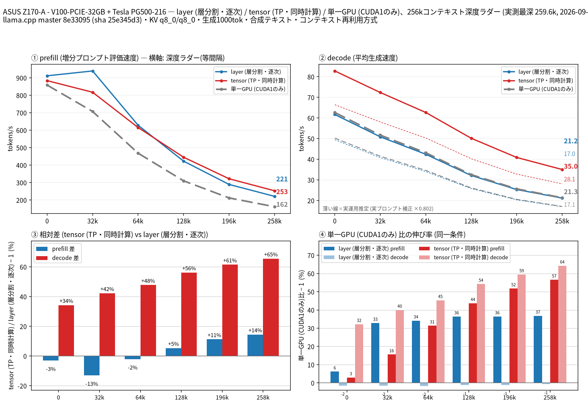

# Tesla V100 2枚で Qwen3.8 27B の split-mode を比較（単一GPU ベースライン付き）

- **作成者**: kuraneko1
- **作成日**: 2026-09-22

## 概要

ASUS Z170-A に Tesla V100-PCIE-32GB と Tesla PG500-216（32 GB × 2、PCIe 3.0 x8/x8、NVLink なし）を載せ、Qwen3.8-27B UD-Q4_K_M を 262k コンテキストまで測定しました。`--split-mode layer` / `tensor` に加えて **単一 V100（CUDA1 のみ）のベースライン**も同じ条件で取得しています（モデル約 16 GB が 32 GB カード 1 枚に載るため）。

decode は全深度で tensor が最速で、layer は単一 GPU とほぼ同じでした（32k で tensor 72.3 / layer 50.9 / 単一 51.7 t/s、260k で 35.0 / 21.2 / 21.3 t/s）。prefill は 128k 付近までは layer、それ以深では tensor が最速です。バッチは `-b 8192 -ub 2048` を使っています（同機で事前にスクリーニングして選定。理由は「条件」参照）。

## ハードウェア

| 項目 | 内容 |
|------|------|
| コンピュータ / マザーボード | ASUS Z170-A |
| GPU | Tesla V100-PCIE-32GB（SM70）+ Tesla PG500-216（SM70）。VRAM 32 GB × 2（計 64 GB） |
| GPU 接続 | 両カードとも PCIe 3.0 x8（上限 x16 に対し x8 で動作）、NVLink なし。GPU 間は PHB（PCIe ホストブリッジ）経由 |
| CPU | Intel Core i7-6700K（4 コア / 8 スレッド） |
| メモリ | 31 GiB |
| 電源 | 不明 |

## ソフトウェア環境

| 項目 | 内容 |
|------|------|
| OS | Ubuntu 24.04.4 LTS / Linux 7.0.0-31-generic |
| GPU ドライバ | NVIDIA 580.173.02 |
| llama.cpp | 0.4.0-dev（build 1、commit 8e33095）、CUDA バックエンド（sm_70）。`llama-server` sha256 `25e345d3169033bef4ba54497415f888eabb572e0b4ca3d69967aef430c4874c` |

## ベンチマーク

### 条件

| 項目 | 内容 |
|------|------|
| ツール | llama-split-bench 7af72d4 |
| モデル | Qwen3.8-27B UD-Q4_K_M（16,464,440,224 バイト）+ mmproj-BF16.gguf |
| 測定モード | layer / tensor（CUDA0+CUDA1）、single（CUDA1 のみ） |
| ctx / stages | 262144 / 0,32000,64000,128000,196000,258000 |
| KV キャッシュ | q8_0 / q8_0 |
| 投機的デコード | あり（`--spec-type draft-mtp --spec-draft-n-max 2`、draft KV も q8_0。合成テキストでの採択率 0.997 @32k、実プロンプトでは 0.54〜0.80） |
| バッチ | `-b 8192 -ub 2048`（3 モード共通） |
| その他 | `-fa on`、`-ngl all`、`-t 8`、`--load-mode mlock`、`--parallel 1`、PORT 18081 |

**バッチを既定から変えている理由**: 同機の単一 V100 で 32k のスクリーニング（4 点、prefill は 32k ラダー / 新規プロンプト）を行い、`-b 2048 -ub 512`（llama.cpp 既定）568.5 t/s → `-ub 1024` 653.5 → `-ub 2048` 706.7 → `-ub 4096` 732.7 t/s と伸びることを確認したうえで、**3 モードすべてが 262k で起動できる最大値**として `-b 8192 -ub 2048` を採用しています（`-ub 4096` は単一カードの 262k で KV 8704 MiB + compute buffer 3712 MiB が入らず起動不可）。この設定で単一 V100 の prefill は既定比 +13〜24%、decode はほぼ変化しません。

### 起動コマンド

計測に使った `llama-server` の起動引数（`argv-*.txt` の内容そのまま。3 モードとも差は `--device` と `--split-mode` だけです）。

```bash
# layer（CUDA0+CUDA1、層分割）
~/llama.cpp/build/bin/llama-server -m ~/llama-models/models/Qwen3.8-27B/Qwen3.8-27B-UD-Q4_K_M.gguf --host 127.0.0.1 --port 18081 --device CUDA0,CUDA1 --split-mode layer -ngl all -fa on -c 262144 --parallel 1 -t 8 --jinja --cache-type-k q8_0 --cache-type-v q8_0 --spec-type draft-mtp --spec-draft-n-max 2 --spec-draft-device CUDA0,CUDA1 --load-mode mlock --cache-ram 8192 --cache-idle-slots --cache-reuse 256 --mmproj ~/llama-models/models/Qwen3.8-27B/mmproj-BF16.gguf -b 8192 -ub 2048 --alias Qwen3.8-27B-UD-Q4_K_M

# tensor（CUDA0+CUDA1、TP=2）
~/llama.cpp/build/bin/llama-server -m ~/llama-models/models/Qwen3.8-27B/Qwen3.8-27B-UD-Q4_K_M.gguf --host 127.0.0.1 --port 18081 --device CUDA0,CUDA1 --split-mode tensor -ngl all -fa on -c 262144 --parallel 1 -t 8 --jinja --cache-type-k q8_0 --cache-type-v q8_0 --spec-type draft-mtp --spec-draft-n-max 2 --spec-draft-device CUDA0,CUDA1 --load-mode mlock --cache-ram 8192 --cache-idle-slots --cache-reuse 256 --mmproj ~/llama-models/models/Qwen3.8-27B/mmproj-BF16.gguf -b 8192 -ub 2048 --alias Qwen3.8-27B-UD-Q4_K_M

# single（CUDA1 のみ）
~/llama.cpp/build/bin/llama-server -m ~/llama-models/models/Qwen3.8-27B/Qwen3.8-27B-UD-Q4_K_M.gguf --host 127.0.0.1 --port 18081 --device CUDA1 -ngl all -fa on -c 262144 --parallel 1 -t 8 --jinja --cache-type-k q8_0 --cache-type-v q8_0 --spec-type draft-mtp --spec-draft-n-max 2 --spec-draft-device CUDA1 --load-mode mlock --cache-ram 8192 --cache-idle-slots --cache-reuse 256 --mmproj ~/llama-models/models/Qwen3.8-27B/mmproj-BF16.gguf -b 8192 -ub 2048 --alias Qwen3.8-27B-UD-Q4_K_M
```
### 結果



depth ごとの prefill / decode（t/s）。depth 0 の prefill は新規プロンプト（pp2048）の値です。ラダー初段（11 トークン）の prefill は計測上の artifact のため載せていません。

| depth | prefill layer | prefill tensor | prefill 単一V100 | decode layer | decode tensor | decode 単一V100 |
|------:|------:|------:|------:|------:|------:|------:|
| 32k | 939.3 | 817.3 | 707.0 | 50.9 | 72.3 | 51.7 |
| 64k | 628.2 | 615.4 | 468.3 | 42.4 | 62.7 | 43.1 |
| 128k | 422.7 | 445.2 | 309.9 | 32.1 | 50.2 | 32.5 |
| 196k | 289.3 | 321.8 | 212.1 | 25.3 | 40.8 | 25.6 |
| 260k | 221.1 | 253.0 | 161.6 | 21.2 | 35.0 | 21.3 |

depth 0 の新規プロンプト prefill（t/s）:

| プロンプト長 | layer | tensor | 単一V100 |
|------:|------:|------:|------:|
| 512 | 638.8 | 615.8 | 604.6 |
| 2048 | 911.5 | 883.8 | 858.3 |
| 8192 | 1058.2 | 908.1 | 847.8 |

単一 V100 を 100% としたときの伸び率（ラダー、32k → 260k）:

| 系列 | prefill | decode |
|------|---------|--------|
| layer | +32.8 / +34.2 / +36.4 / +36.4 / +36.8 % | −1.6 / −1.7 / −1.3 / −1.2 / −0.7 % |
| tensor | +15.6 / +31.4 / +43.7 / +51.8 / +56.5 % | +40.0 / +45.3 / +54.2 / +59.5 / +64.3 % |

MTP の採択率は合成テキストで全モード・全深度 0.997、実プロンプト 3 本（temperature 0.7、tensor モード）では 0.54〜0.80、decode は 60.0〜74.3 t/s でした。ここから求めた補正係数 0.802 を掛けた値を、図に破線の「実運用推定」として示しています。

### 所感

- **decode は tensor が全深度で圧勝です**。layer に対して +42〜+66%、単一 V100 に対して +40〜+64% で、深いほど差が開きます。x8 リンク（実測 単方向 6.6 GB/s）でも、1 トークンあたりの計算を 2 枚に分ける効果が通信コストを上回っています。
- **layer の decode は単一 V100 とほぼ同一**（−0.7〜−1.7%）でした。層分割は VRAM を 2 枚に分ける手段であって、decode を速くする手段ではない、という以前の結果を再確認しています。
- **prefill は 128k を境に優劣が入れ替わります**。32k では layer 939 > tensor 817 > 単一 707 ですが、128k で tensor 445 > layer 423、260k では tensor 253 > layer 221 > 単一 162 です。ただし単一 V100 比では layer が全深度で +33〜37% と安定しており、prefill 主体の長文エージェント用途では layer、decode 主体なら tensor という使い分けになります。
- **単一 V100 も 262k で実用域です**。VRAM は 30.3〜30.8 GB / 32.8 GB とほぼ一杯ですが、prefill でも 260k で 162 t/s、decode 21.3 t/s を出します。「2 枚目は decode を 1.4〜1.6 倍にするために効く」というのが本計測の読みです。
- VRAM 使用量（起動直後 / 最深段）は layer 18.5 / 18.7 GB（GPU0）・24.7 / 25.2 GB（GPU1）、tensor 17.9 / 18.3 GB・16.7 / 17.1 GB、単一 30.3 / 30.8 GB（すべて 32.8 GB カード）。tensor は 2 枚にほぼ均等、layer は最後のカードが約 6 GB 多く使う配分でした。
- 本計測は `-b 8192 -ub 2048` 固定の比較であり、他のバッチ設定での split-mode の優劣は未検証です。また 8k/16k などの浅いコンテキストや他の KV 量子化は対象外です。

## 添付

- [run-info.json](attachment/2026-09-22_210206_comparing_split_modes_of_qwen3.8_27b_on_2x_tesla_v100_with_single_gpu_baseline/run-info.json) / [run-info.layer-tensor.json](attachment/2026-09-22_210206_comparing_split_modes_of_qwen3.8_27b_on_2x_tesla_v100_with_single_gpu_baseline/run-info.layer-tensor.json)（後述のとおり single アームは追記で取得したため、追記前後の 2 つの run-info を添付しています）
- [split-bench-ja.png](attachment/2026-09-22_210206_comparing_split_modes_of_qwen3.8_27b_on_2x_tesla_v100_with_single_gpu_baseline/split-bench-ja.png) / [split-bench-en.png](attachment/2026-09-22_210206_comparing_split_modes_of_qwen3.8_27b_on_2x_tesla_v100_with_single_gpu_baseline/split-bench-en.png)
- [results-layer.json](attachment/2026-09-22_210206_comparing_split_modes_of_qwen3.8_27b_on_2x_tesla_v100_with_single_gpu_baseline/results-layer.json) / [results-layer-pp0.json](attachment/2026-09-22_210206_comparing_split_modes_of_qwen3.8_27b_on_2x_tesla_v100_with_single_gpu_baseline/results-layer-pp0.json) / [results-tensor.json](attachment/2026-09-22_210206_comparing_split_modes_of_qwen3.8_27b_on_2x_tesla_v100_with_single_gpu_baseline/results-tensor.json) / [results-tensor-pp0.json](attachment/2026-09-22_210206_comparing_split_modes_of_qwen3.8_27b_on_2x_tesla_v100_with_single_gpu_baseline/results-tensor-pp0.json) / [results-single.json](attachment/2026-09-22_210206_comparing_split_modes_of_qwen3.8_27b_on_2x_tesla_v100_with_single_gpu_baseline/results-single.json) / [results-single-pp0.json](attachment/2026-09-22_210206_comparing_split_modes_of_qwen3.8_27b_on_2x_tesla_v100_with_single_gpu_baseline/results-single-pp0.json) / [results-real.json](attachment/2026-09-22_210206_comparing_split_modes_of_qwen3.8_27b_on_2x_tesla_v100_with_single_gpu_baseline/results-real.json)
- [argv-layer.txt](attachment/2026-09-22_210206_comparing_split_modes_of_qwen3.8_27b_on_2x_tesla_v100_with_single_gpu_baseline/argv-layer.txt) / [argv-tensor.txt](attachment/2026-09-22_210206_comparing_split_modes_of_qwen3.8_27b_on_2x_tesla_v100_with_single_gpu_baseline/argv-tensor.txt) / [argv-single.txt](attachment/2026-09-22_210206_comparing_split_modes_of_qwen3.8_27b_on_2x_tesla_v100_with_single_gpu_baseline/argv-single.txt)
- バッチ選定の根拠（単一 V100 / 32k の 4 点スクリーニング）: [s32-ub512](attachment/2026-09-22_210206_comparing_split_modes_of_qwen3.8_27b_on_2x_tesla_v100_with_single_gpu_baseline/supplement-batch-screening/s32-ub512/results-single.json)（[argv](attachment/2026-09-22_210206_comparing_split_modes_of_qwen3.8_27b_on_2x_tesla_v100_with_single_gpu_baseline/supplement-batch-screening/s32-ub512/argv-single.txt)） / [s32-ub1024](attachment/2026-09-22_210206_comparing_split_modes_of_qwen3.8_27b_on_2x_tesla_v100_with_single_gpu_baseline/supplement-batch-screening/s32-ub1024/results-single.json) / [s32-ub2048](attachment/2026-09-22_210206_comparing_split_modes_of_qwen3.8_27b_on_2x_tesla_v100_with_single_gpu_baseline/supplement-batch-screening/s32-ub2048/results-single.json) / [s32-ub4096](attachment/2026-09-22_210206_comparing_split_modes_of_qwen3.8_27b_on_2x_tesla_v100_with_single_gpu_baseline/supplement-batch-screening/s32-ub4096/results-single.json)

### 計測の内訳（再現性のため）

- layer / tensor の 2 モードは 2026-09-22 17:26〜17:58 に 1 回の run として取得しました。
- single アームは同日 20:34〜20:57 に同タグへ `--reuse` で追記しています（`-b 8192 -ub 2048` は共通）。そのため `run-info.json` の `modes` は追記実行分（single）のみを記録しており、layer / tensor の起動引数は `argv-layer.txt` / `argv-tensor.txt` に残っています。追記前の run-info は `run-info.layer-tensor.json` として添付しました。
- 実プロンプト補正は追記後に tensor アームのサーバで測り直しています（追記直後は single で測った値が tensor 基準で割られ、補正係数が 0.589 と過小になったため）。
