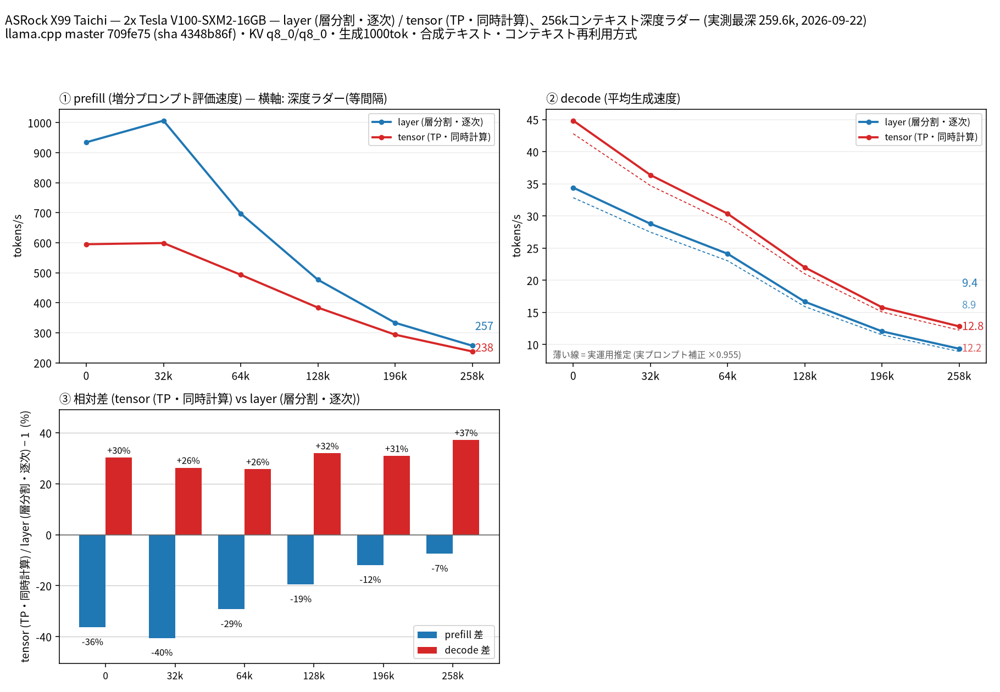

# Tesla V100 2 枚で Qwen3.8 27B の split-mode を比較

- **作成者**: miminashi
- **作成日**: 2026-09-23

## 概要

ASRock X99 Taichi に Tesla V100-SXM2-16GB を 2 枚載せた構成で、Huihui-Qwen3.8-27B-abliterated（UD-Q4_K_XL）の `--split-mode layer` / `tensor` を 262k コンテキストまで比較しました。
decode は全深度で tensor が layer より 26〜37% 速く（depth 0 で 34.4 → 44.8 t/s、258k で 9.4 → 12.8 t/s）、prefill は全深度で layer が速い結果でした（差は深いほど縮小し、258k で 7%）。
モデル（17.4 GB）が V100 1 枚の VRAM に収まらないため、単一 GPU の計測はしていません。

## ハードウェア

| 項目 | 内容 |
|------|------|
| コンピュータ / マザーボード | ASRock X99 Taichi |
| GPU | Tesla V100-SXM2-16GB × 2（VRAM 16 GB / 枚、電力上限 300 W） |
| GPU 接続 | GPU0: PCIe Gen3 x8、GPU1: PCIe Gen2 x8（nvidia-smi の current / max とも同値）。NVLink なし（`nvidia-smi topo -m` で PHB） |
| CPU | Intel Core i7-6800K（6 コア / 12 スレッド） |
| メモリ | 32 GB（`free -h` で 31 GiB）。種類は不明 |
| 電源 | 不明 |

## ソフトウェア環境

| 項目 | 内容 |
|------|------|
| OS | Ubuntu 24.04.3 LTS / Linux 6.8.0-106-generic |
| GPU ドライバ | 580.65.06（CUDA 12.9） |
| llama.cpp | 709fe75（version 0.4.1-dev build 187）、CUDA バックエンド（`CMAKE_CUDA_ARCHITECTURES=70`、`GGML_CUDA_FA_ALL_QUANTS=ON`）。`GGML_CUDA_NCCL=ON` だが NCCL ライブラリが見つからず、実行時は `NCCL not compiled in; falling back to internal AllReduce` となっている（= NCCL なし） |

## ベンチマーク

### 条件

| 項目 | 内容 |
|------|------|
| ツール | llama-split-bench 7af72d4 |
| モデル | Huihui-Qwen3.8-27B-abliterated-UD-Q4_K_XL（17.4 GB） |
| 測定モード | layer / tensor（いずれも CUDA0+CUDA1）。single は VRAM 不足のため除外 |
| ctx / stages | 262144 / 0,32000,64000,128000,196000,258000 |
| KV キャッシュ | q8_0 / q8_0 |
| 投機的デコード | なし（`SPEC_ARGS=`。MTP ヘッド無し） |
| その他 | `-fa on`、`-t 6`、`-ngl all`、生成 1000 トークン / 段 |

### 結果

depth ごとの prefill / decode（t/s）。depth 0 の prefill は新規プロンプト（pp2048）の値です。ラダー初段（11 トークン）の prefill は表に載せていません。

| depth | prefill layer | prefill tensor | decode layer | decode tensor |
|------:|------:|------:|------:|------:|
| 0 | 934.8 | 595.2 | 34.41 | 44.84 |
| 32k | 1006.9 | 599.2 | 28.79 | 36.38 |
| 64k | 697.5 | 493.6 | 24.13 | 30.35 |
| 128k | 477.1 | 384.1 | 16.66 | 22.00 |
| 196k | 333.6 | 294.0 | 12.06 | 15.79 |
| 258k | 257.1 | 238.0 | 9.35 | 12.83 |

depth 0 の新規プロンプト prefill（t/s）:

| プロンプト長 | layer | tensor |
|------:|------:|------:|
| 512 | 769.3 | 533.7 |
| 1978 | 934.8 | 595.2 |
| 8077 | 1093.3 | 632.7 |

実プロンプト（tensor、3 種、1200 トークン生成）の decode は 42.3〜43.5 t/s で、ラダー depth 0 の合成テキストに対する補正係数は 0.955 でした（図の薄い破線）。

### 所感

- **decode は tensor が全深度で layer より速い**（+26〜37%）。深くなっても差は縮まらず、258k では +37% でした。
- **prefill は layer が全深度で速い**。浅い所では tensor が 36〜40% 遅いものの、深くなるほど差が縮まり、258k では 7% 差です。
- tensor の prefill は、NCCL を使わない内部 AllReduce と、GPU1 が PCIe Gen2 x8 で接続されていることの影響を受けている可能性があります（未検証）。
- 2 枚合計 32 GB で 262k コンテキスト（q8_0 KV）が両モードとも載りました。layer モードの VRAM 使用量は GPU0 14.3 GB / GPU1 15.6 GB でした。
- 計測中の GPU 最高温度は 85℃（GPU1、layer）でした。87℃ を 15 秒続けて超えたらサーバを止める温度ガードを並行して動かしていましたが、一度も作動していません。

## 添付

- [run-info.json](attachment/2026-09-23_060231_comparing_split_modes_of_qwen3.8_27b_on_2x_tesla_v100/run-info.json)
- [results-layer.json](attachment/2026-09-23_060231_comparing_split_modes_of_qwen3.8_27b_on_2x_tesla_v100/results-layer.json) / [results-layer-pp0.json](attachment/2026-09-23_060231_comparing_split_modes_of_qwen3.8_27b_on_2x_tesla_v100/results-layer-pp0.json)
- [results-tensor.json](attachment/2026-09-23_060231_comparing_split_modes_of_qwen3.8_27b_on_2x_tesla_v100/results-tensor.json) / [results-tensor-pp0.json](attachment/2026-09-23_060231_comparing_split_modes_of_qwen3.8_27b_on_2x_tesla_v100/results-tensor-pp0.json)
- [results-real.json](attachment/2026-09-23_060231_comparing_split_modes_of_qwen3.8_27b_on_2x_tesla_v100/results-real.json)
- [argv-layer.txt](attachment/2026-09-23_060231_comparing_split_modes_of_qwen3.8_27b_on_2x_tesla_v100/argv-layer.txt) / [argv-tensor.txt](attachment/2026-09-23_060231_comparing_split_modes_of_qwen3.8_27b_on_2x_tesla_v100/argv-tensor.txt)
- [split-bench-en.png](attachment/2026-09-23_060231_comparing_split_modes_of_qwen3.8_27b_on_2x_tesla_v100/split-bench-en.png)
