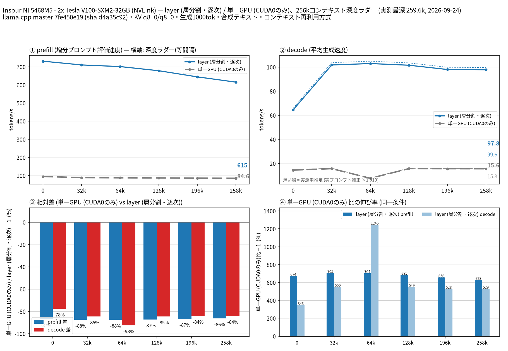

# Tesla V100-SXM2-32GB 2 枚で Qwen3.8 Flash Next（MoE）の layer 分割と単一 GPU を比較

- **作成者**: pentacoxian
- **作成日**: 2026-09-24

## 概要

Inspur NF5468M5 の Tesla V100-SXM2-32GB 2 枚（NVLink 接続）で、Qwen3.8 Flash Next（512 エキスパートの MoE、GGUF 80 GiB）を `--split-mode layer`（2 枚）と単一 GPU で 262k コンテキストまで比較しました。
モデルは VRAM 合計 64 GB に収まらないため、両モードとも `--fit on` で入りきらない分をホスト RAM（CPU）に置いています。
layer（2 枚）は prefill 615〜738 t/s、decode 約 98〜103 t/s（MTP 投機的デコードあり）を 258k まで維持し、単一 GPU と比べて prefill 約 7〜8 倍、decode 約 6 倍でした。
tensor 分割はこのモデルのアーキテクチャ（`qwen4exp`）で未実装のため測定していません。

## ハードウェア

| 項目 | 内容 |
|------|------|
| コンピュータ / マザーボード | Inspur NF5468M5（マザーボード YZMB-01130-107） |
| GPU | Tesla V100-SXM2-32GB × 2（VRAM 32 GB / 枚） |
| GPU 接続 | 両 GPU とも PCIe Gen3 x16（nvidia-smi の current / max とも同値）。GPU0–GPU1 間は NVLink（`nvidia-smi topo -m` で NV1、1 リンクあたり 25.8 GB/s） |
| CPU | Intel Xeon Platinum 8260 × 2（24 コア / 48 スレッド × 2、NUMA 2 ノード） |
| メモリ | 314 GiB（`free -h`）。種類は不明 |
| 電源 | 不明 |

## ソフトウェア環境

| 項目 | 内容 |
|------|------|
| OS | Ubuntu 20.04.6 LTS（コンテナ内）/ Linux 6.8.0-138-generic |
| GPU ドライバ | 580.159.03（CUDA 13.0）。ビルドは CUDA Toolkit 12.9.86 |
| llama.cpp | 0.5.0（7fe450e19）に [`llama-v0.5.0-clean-20260924.patch`](https://huggingface.co/pentacoxian-dev/Qwen3.8-Flash-Next-IQ3E-Q8D-MTP-GGUF/blob/d3de0ef2487c3f48846cc8beffef44a36929e7b2/patches/llama-v0.5.0-clean-20260924.patch)（sha256 `442ad27f…`）を当てたもの。`qwen4exp` 対応（FreeToken の MoE 移植を含む）、MTP 投機的デコード、V100（sm_70）向け最適化を含みます。CUDA バックエンド（`CMAKE_CUDA_ARCHITECTURES=70`）。図のタイトルの「master 7fe450e19」はベースのコミットで、実際のバイナリはパッチ適用版です（バイナリの sha256 `d4a35c92…` は run-info.json に記録） |

## ベンチマーク

### 条件

| 項目 | 内容 |
|------|------|
| ツール | llama-split-bench 7af72d4（ローカル変更あり: 後述の `GUARD=off`） |
| モデル | Qwen3.8-Flash-Next-IQ3E-Q8D-MTP.gguf（[pentacoxian-dev/Qwen3.8-Flash-Next-IQ3E-Q8D-MTP-GGUF](https://huggingface.co/pentacoxian-dev/Qwen3.8-Flash-Next-IQ3E-Q8D-MTP-GGUF)、80.0 GiB。アーキテクチャ `qwen4exp`、512 エキスパート中 10 個がアクティブ。ルーティングされるエキスパートは UD-IQ3_XXS、密なテンソルと MTP ヘッドは Q8_0。量子化の内訳はモデルカードを参照） |
| 測定モード | layer（CUDA0+CUDA1）/ single（CUDA0 のみ）。tensor は `qwen4exp` で未実装のため除外 |
| ctx / stages | 262144 / 0,32000,64000,128000,196000,258000 |
| KV キャッシュ | q8_0 / q8_0 |
| 投機的デコード | `--spec-type draft-mtp --spec-draft-n-max 3` |
| その他 | `-fa on`、`-ngl auto`、`--fit on --fit-target 512`、`-t 48 --threads-batch 48`、`--batch-size 2048 --ubatch-size 512`、`--numa distribute`、`--load-mode mmap`、`--reasoning off`、生成 1000 トークン / 段。環境変数 `GGML_CUDA_P2P=1 GGML_FT_GRAPH_CACHE=1 GGML_FT_GRAPH_CACHE_MIN_NODES=32 GGML_CUDA_GRAPH_OPT=1 LLAMA_QWEN4EXP_HC_FUSION=1 LLAMA_MTP_N_UBATCH=32 LLAMA_GPU_ARGMAX=1`（全引数は argv-*.txt） |

### 結果

depth ごとの prefill / decode（t/s）。depth 0 の prefill は新規プロンプト（pp2048）の値です。ラダー初段（11 トークン）の prefill は表に載せていません。

| depth | prefill layer | prefill single | decode layer | decode single |
|------:|------:|------:|------:|------:|
| 0 | 730.9 | 94.5 | 64.5 | 14.5 |
| 32k | 710.3 | 88.2 | 101.7 | 15.7 |
| 64k | 701.2 | 87.2 | 102.9 | 7.7 |
| 128k | 678.3 | 86.4 | 101.5 | 15.6 |
| 196k | 644.4 | 85.3 | 98.0 | 15.6 |
| 258k | 615.4 | 84.6 | 97.8 | 15.6 |

depth 0 の新規プロンプト prefill（t/s）:

| プロンプト長 | layer | single |
|------:|------:|------:|
| 512 | 656.8 | 89.5 |
| 1978 | 730.9 | 94.5 |
| 8077 | 737.8 | 92.2 |

MTP のドラフト受理率は、ラダーの合成テキストでは depth 32k 以降 96〜98%、depth 0（11 トークンのプロンプトから 1000 トークン生成）では layer 52% / single 79% でした。
実プロンプト（layer、3 種、temp 0.7 / top_p 0.9、1200 トークン生成）の decode は 59.9〜73.5 t/s、受理率 43〜61% で、ラダー depth 0 に対する補正係数は 1.019 でした（図の薄い破線）。

### 所感

- **2 枚の layer 分割は、単一 GPU より prefill が約 7〜8 倍、decode が約 6 倍速い**。このモデルは V100 1 枚では大半のエキスパートを CPU 側に置くことになるため、2 枚目は VRAM の追加がそのまま速度に効いています。
- layer の prefill は 8k の 738 t/s から 258k の 615 t/s へ約 17% 低下するだけで、decode も 32k〜258k で 98〜103 t/s とほぼ一定でした。
- decode は MTP の受理率に強く依存します。合成テキスト（受理率約 97%）では約 100 t/s ですが、実プロンプトでは受理率 43〜61% で 60〜74 t/s でした。
- single の depth 64k の decode（7.7 t/s）だけが前後の段（15.6 t/s 前後）の半分でした。mmap で読み込んだモデルのページインなどが考えられますが、原因は未検証です。
- VRAM 使用量は layer で GPU0 31.8 GB / GPU1 31.7 GB、single で GPU0 31.4 GB でした（`--fit-target 512`）。
- 計測中の GPU 最高温度は 76℃（GPU0、layer）、最大消費電力は 309 W（GPU0、layer）でした。
- コンテナ内で実行しており、nvidia-smi がホスト側の PID を返すため、ツールの foreign-process guard が自分のサーバを他プロセスと誤検知して中断しました。ローカルで `GUARD=off`（guard 無効化）を追加して計測しています。計測中、他の GPU プロセスは動かしていません。

## 添付

- [run-info.json](attachment/2026-09-24_144622_comparing_layer_split_and_single_gpu_of_qwen3.8_flash_next_on_2x_tesla_v100_sxm2_32gb/run-info.json)
- [results-layer.json](attachment/2026-09-24_144622_comparing_layer_split_and_single_gpu_of_qwen3.8_flash_next_on_2x_tesla_v100_sxm2_32gb/results-layer.json) / [results-layer-pp0.json](attachment/2026-09-24_144622_comparing_layer_split_and_single_gpu_of_qwen3.8_flash_next_on_2x_tesla_v100_sxm2_32gb/results-layer-pp0.json)
- [results-single.json](attachment/2026-09-24_144622_comparing_layer_split_and_single_gpu_of_qwen3.8_flash_next_on_2x_tesla_v100_sxm2_32gb/results-single.json) / [results-single-pp0.json](attachment/2026-09-24_144622_comparing_layer_split_and_single_gpu_of_qwen3.8_flash_next_on_2x_tesla_v100_sxm2_32gb/results-single-pp0.json)
- [results-real.json](attachment/2026-09-24_144622_comparing_layer_split_and_single_gpu_of_qwen3.8_flash_next_on_2x_tesla_v100_sxm2_32gb/results-real.json)
- [argv-layer.txt](attachment/2026-09-24_144622_comparing_layer_split_and_single_gpu_of_qwen3.8_flash_next_on_2x_tesla_v100_sxm2_32gb/argv-layer.txt) / [argv-single.txt](attachment/2026-09-24_144622_comparing_layer_split_and_single_gpu_of_qwen3.8_flash_next_on_2x_tesla_v100_sxm2_32gb/argv-single.txt)
- [split-bench-en.png](attachment/2026-09-24_144622_comparing_layer_split_and_single_gpu_of_qwen3.8_flash_next_on_2x_tesla_v100_sxm2_32gb/split-bench-en.png)
